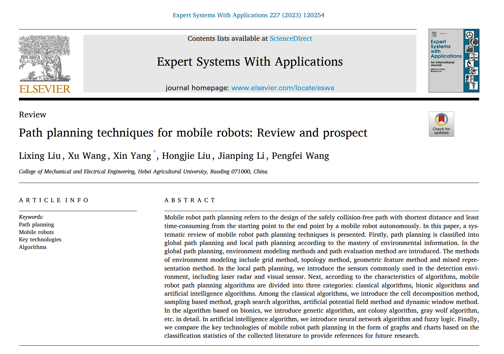
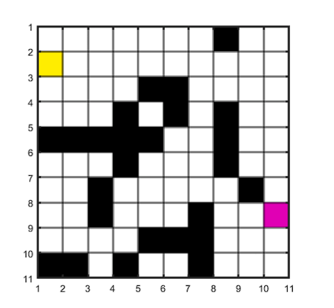
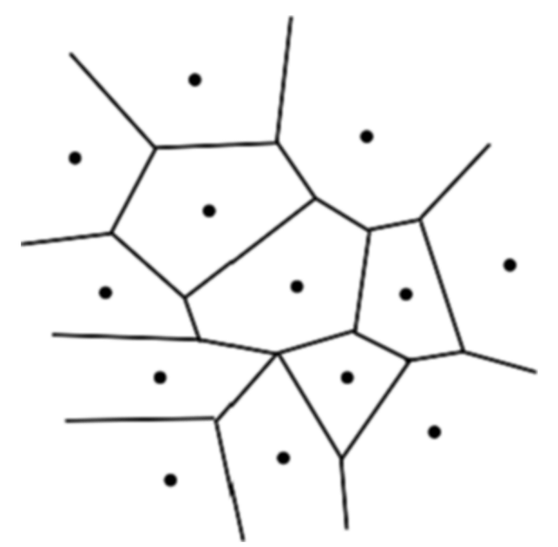

---
# try also 'default' to start simple
# theme: seriph
# random image from a curated Unsplash collection by Anthony
# like them? see https://unsplash.com/collections/94734566/slidev
# background: https://cover.sli.dev
# some information about your slides (markdown enabled)
title: Seminar
info: |
  Seminar
# apply UnoCSS classes to the current slide
class: text-center
# https://sli.dev/features/drawing
drawings:
  persist: false
# slide transition: https://sli.dev/guide/animations.html#slide-transitions
# transition: slide-left
# enable MDC Syntax: https://sli.dev/features/mdc
mdc: true
---

## Path planning techniques for mobile robots: Review and prospect

  Zhao Zhiyu

<!--
Hello everyone. My name is Zhao Zhiyu.
My research is about helping robots find the best path in a busy warehouse.
-->

---
theme: seriph
layout: default
---

## Paper Reading Plan

 

### Last Week

* **Paper:** *Path Planning Technique for Mobile Robots: A Review*
* **Focus:** Got a foundational overview of the path plan methods.

 

### This Week

* **Paper:** *Path planning techniques for mobile robots: Review and prospect*
* **Focus:** Understanding the core concepts of global vs. local planning (Chapter 2).

 

### Next Week

* **Paper:** *Path planning techniques for mobile robots: Review and prospect* (Continue)
* **Focus:** Moving on to the "Algorithms" section (Chapter 3) of the paper.

---
theme: seriph
layout: default
---

  

---
theme: seriph
layout: default
---

Today, we will look at a paper about how robots find their way.

* **1. Introduction**
    * What are mobile robots and why is planning a path so important?

* **2. Global & Local Path Planning**
    * The two main ways robots plan. Global is like using a full map, while Local is for exploring unknown areas.

* **3. Path Planning Algorithms**
    * Different methods robots use to choose the best path. This includes classic methods, ideas from nature, and AI. 

* **4. Conclusion & Future**
    * What we learned and what's next for robot path planning.
    
---
theme: seriph
layout: default
---

## Two Basic Ways of Path Planning

* **Global Planning**
    * The robot has the **full map** from the start.
    * The goal: find the **best possible route** to the finish line.
    * This is also called **offline planning**.

* **Local Planning**
    * The robot **doesn't know the map** and must explore.
    * It's super flexible, but might get stuck or not find the perfect path.
    * This is also called **online planning** .

---
theme: seriph
layout: default
---

## Making a Map for the Robot

 

<h4>Grid Method (GM)</h4>
<ul>
  <li><b>What it is:</b> Cuts the world into small squares, like a checkerboard.</li>
  <li>✅ <b>Good:</b> Super simple and easy to use.</li>
  <li>❌ <b>Bad:</b> The square size is tricky. Too big is inaccurate, too small uses lots of memory.</li>
</ul>

<h4>Topological Method (TM)</h4>
<ul>
  <li><b>What it is:</b> Connects important places with lines, like a subway map.</li>
  <li>✅ <b>Good:</b> Great for very big areas and saves memory.</li>
  <li>❌ <b>Bad:</b> Can be difficult to create and maintain.</li>
</ul>

---
theme: seriph
layout: default
---

## More Choices for Making a Map

 

### Geometric Method (GCM)
* **What it is:** Uses simple shapes like lines and circles to describe the world.
* ✅ **Good:** Saves a lot of memory and is easy to work with.
* ❌ **Bad:** It's hard to find these simple shapes in a messy, complex place.

 

### Mixed Method (MR)
* **What it is:** A mix of the best parts from other methods. It uses a detailed map for small areas and a simple map for the big picture
* ✅ **Good:** You get the speed of one method and the accuracy of another, all in one.

---
theme: seriph
layout: default
---

## How to Judge a Good Path?

To measure how good a path planning algorithm is, the paper suggests seven methods.

* **Planning Time ($t_m$)**: How fast is the algorithm?

* **Time Reliability (RT)**: Is the planning time always consistent?

* **Path Length ($D_m$)**: How short is the path?

* **Length Reliability (RD)**: Does the algorithm make similar paths on different maps?

* **Path Smoothness (RC)**: How many turns does the robot have to make?

* **Tracking Time (ETT)**: How long will the robot take to actually follow the path?

* **Success Rate (SR)**: Can the algorithm always find a safe, collision-free path?

---
theme: seriph
layout: default
---

## Local Planning: Sensing an Unknown World

Local path planning depends on sensors to see the environment in real-time, especially when building a map from scratch.

* **Laser Radar Sensor (LRS)**
    * An active sensor often used for building maps.
    * ✅ **Good:** Has a long detection range, is very accurate, and works well even when lighting changes.
    * ❌ **Bad:** It is expensive and can have trouble modeling environments with repetitive shapes.

* **Visual Sensor (VS) / Camera**
    * A passive sensor that gets information from reflected light.
    * ✅ **Good:** Has a wider detection range and can capture rich image information.
    * ❌ **Bad:** Can be easily confused by uneven lighting or shadows, which can cause it to miss or wrongly detect things.

---
theme: seriph
layout: default
---

## 1 + 1 > 2: The Power of Fusing Sensors

* **What is MIF (Multi-sensor Information Fusion)?**
    * It means using algorithms to combine data from many sensors.
    * The goal is to get a more reliable and accurate picture of the world around the robot.

* **Why use MIF?**
    * **They complete each other:** Cameras can't sense distance well, but Lasers (LRS) can. Lasers get less information, but cameras can be used for things like closed-loop detection.
    * **More robust:** A single sensor struggles with complex and changing environments.
    * **Better sensing:** Fusing sensors can give robots 3D perception and improve accuracy by reducing noise.

* **Common Fusion Methods**
    * Camera + Inertial Measurement Unit (IMU).
    * Laser + Camera.