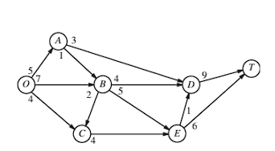
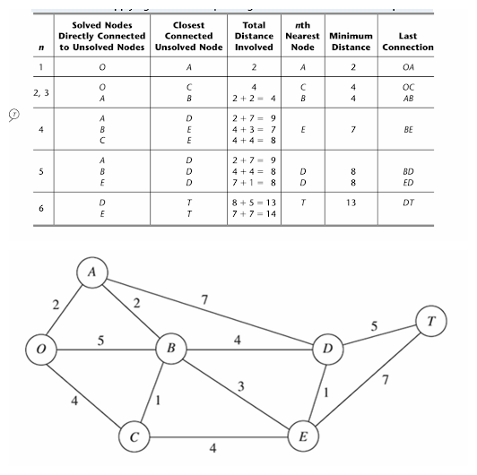

---
# try also 'default' to start simple
# theme: seriph
# random image from a curated Unsplash collection by Anthony
# like them? see https://unsplash.com/collections/94734566/slidev
# background: https://cover.sli.dev
# some information about your slides (markdown enabled)
title: Seminar
info: |
  Seminar
# apply UnoCSS classes to the current slide
class: text-center
# https://sli.dev/features/drawing
drawings:
  persist: false
# slide transition: https://sli.dev/guide/animations.html#slide-transitions
# transition: slide-left
# enable MDC Syntax: https://sli.dev/features/mdc
mdc: true
---

## Network Optimization Models

  Zhao Zhiyu

---
layout: default
---

# Chapter 10: Network Optimization Models

### Background & Applications

* **Ubiquitous Networks:** Transportation, electrical, communications, supply chain management, and financial planning.
* **Visualization:** Network diagrams effectively illustrate relationships between system components (science, social, and economic fields).
* **Technological Impact:** Breakthroughs in algorithms and computer science now allow for solving large-scale network problems.

### 5 Core Problem Types

1.  **Shortest-Path Problem**
2.  **Minimum Spanning Tree Problem**
3.  **Maximum Flow Problem**
4.  **Minimum Cost Flow Problem**
    * *Most general structure: includes the first three plus transportation/assignment problems.*
5.  **Project Management (CPM/PERT)**
    * *Involves time-cost trade-offs.*

---
layout: default
---

# Network Terminology & Components

### Basic Components
* **Network:** A collection of points and lines connecting them.
* **Nodes (Vertices):** The points or circles in the graph.
* **Arcs (Links/Edges):** The lines connecting the nodes.

### Arc Classification
* **Directed Arc:** Flow allowed in only one direction.
* **Undirected Link:** Flow allowed in either direction.
    * *Note: Often analyzed as net flow in one specific direction.*

### Paths & Connectivity
* **Path:** A distinct sequence of arcs connecting two nodes.
* **Cycle:** A path where the starting node and ending node are the same.
* **Connected Network:** An undirected path exists between every pair of nodes.
* **Spanning Tree:** A connected subgraph containing all $n$ nodes with no cycles.

---
layout: default
---

### Case Study: Seervada Park

#### Context
* **Rule:** No private cars; Trams & Jeeps only.
* **Nodes:** 
  * **O:** Entrance | **T:** Scenic Wonder
  * **A-E:** Intermediate Stations
* **Edges:** Distance in miles.

#### 3 Management Problems

1. **Route Planning** (Shortest Path)
   * *Goal:* Best route from Entrance (O) to Destination (T).

2. **Telephone Lines** (Min. Spanning Tree)
   * *Goal:* Connect all stations with min. cable length.

3. **Peak Transport** (Max Flow)
   * *Goal:* Maximize daily trips within road capacity.

  

---
layout: default
---

# Problem 1: The Shortest-Path Problem

### Problem Definition
* **Objective:** Find the path with the **minimum total distance**.
* **Scope:** From **Origin** to **Destination**.
* **Context:** In a connected, undirected network.

### Algorithm Logic (Dijkstra)
* **Concept:** "Fan out" from the origin.
* **Process:** Solve for the nearest node, then the second nearest, and so on.

### The Iteration Process
* **Goal of $n$-th Iteration:** Find the $n$-th nearest node to the origin.
* **Candidates:** Unsolved nodes directly connected to **Solved Nodes**.
* **Calculation:**
  $$\text{Total Dist} = \text{Dist to Solved Node} + \text{Arc Length}$$
* **Selection Rule:** Choose the candidate with the **minimum** total distance to become the next Solved Node.

---
layout: default
---

# Seervada Park: Shortest-Path Results

### Algorithm Execution (based on Table 10.2)
* **n=1:** Start at **O** (Distance 0).
* **n=2,3:** Find nearest neighbors **A** (Dist 2) and **C** / **B** (Dist 4).
* **n=4:** Compare candidates. Find **E** (Dist 7) via path $B \rightarrow E$ (Total 4+3=7).
* **Final Result:** Reach destination **T** with a minimum distance of **13 miles**.

### Optimal Path Solutions
Two shortest paths were found:
1. `O → A → B → E → D → T`
2. `O → A → B → D → T`

  <!-- 
    Image of Table 10.2 (Dijkstra's Algorithm Steps)
    Found a public URL for the table.
  -->
  

