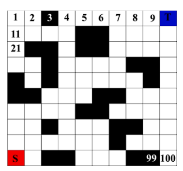
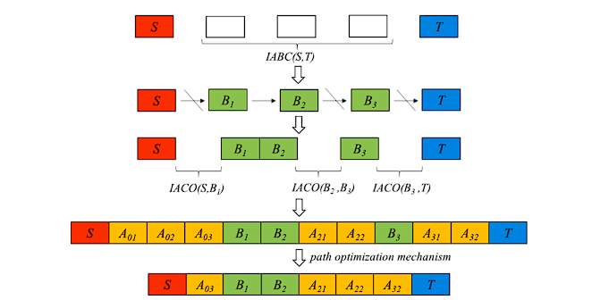
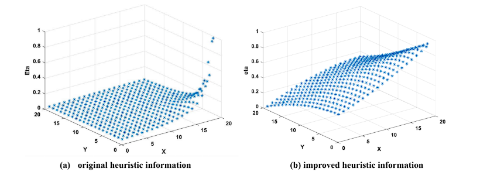
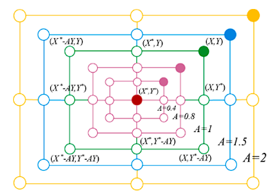
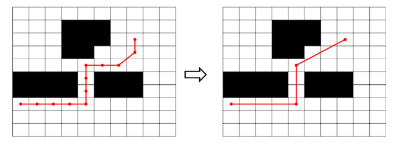

---
# try also 'default' to start simple
# theme: seriph
# random image from a curated Unsplash collection by Anthony
# like them? see https://unsplash.com/collections/94734566/slidev
# background: https://cover.sli.dev
# some information about your slides (markdown enabled)
title: Seminar
info: |
  Seminar
# apply UnoCSS classes to the current slide
class: text-center
# https://sli.dev/features/drawing
drawings:
  persist: false
# slide transition: https://sli.dev/guide/animations.html#slide-transitions
# transition: slide-left
# enable MDC Syntax: https://sli.dev/features/mdc
mdc: true
---

## A mixing algorithm of ACO and ABC for solving path planning of mobile robot

  Zhao Zhiyu

<!--
Hello everyone. My name is Zhao Zhiyu.
My research is about helping robots find the best path in a busy warehouse.
-->

---
theme: seriph
layout: default
---

## Paper Reading Plan

 

### Last Week

* **Paper:** *A genetic algorithm for minimizing energy consumption in warehouses*
* **Focus:** Understanding Solution methodology and Numerical experiments.

 

### This Week

* **Paper:** *A mixing algorithm of ACO and ABC for solving path planning of mobile robot*
* **Focus:** Understanding the Grid environment model and Improved ACO-ABC algorithm.

 

### Next Week

* **Paper:** *A mixing algorithm of ACO and ABC for solving path planning of mobile robot*
* **Focus:** Understanding the Experiments and numerical analysis.

---
# 这是一个注释：使用 'layout: default' 布局
layout: default
---

---
layout: center
---

<h1 class="text-5xl font-bold mb-16 text-center text-blue-900">Table of Contents</h1>

  

    01
    Introduction
  

  

    02
    Mathematical Model of Path Planning
  

  

    03
    Improved ACO-ABC Algorithm
  

  

    04
    Experiments & Numerical Analysis
  

  

    05
    Discussion
  

  

    06
    Conclusion
  

---
layout: two-cols
---

# Research Objective & Modeling

### 1. Research Objective
To find an **optimal and collision-free path** for a mobile robot within the workspace.

### 2. Environment Modeling
Adopting the **Grid Method** to model the space. The environment is divided into a grid map:

* ⬛ **Black Grid**: Represents an **Obstacle**.
* ⬜ **White Grid**: Represents a **Free area**.
* 🟥 **S**: Represents the **Start point**.
* 🟦 **T**: Represents the **Target point**.

::right::

  

    
  

---
layout: default
---

# Research Background & Motivation

### Why combine ACO and ABC?

  <h4 class="text-2xl text-blue-800 font-bold mb-6 border-b-2 border-blue-200 pb-2">
    Ant Colony Optimization (ACO)
  </h4>
  

    

      Pros
      Strong robustness.
    

    

      Cons
      Slow convergence speed, blindness in the early search stage, and easy to fall into local optima.
    

  

  <h4 class="text-2xl text-yellow-700 font-bold mb-6 border-b-2 border-yellow-200 pb-2">
    Artificial Bee Colony (ABC)
  </h4>
  

    

      Pros
      High search efficiency and fast convergence speed.
    

    

      Cons
      Early convergence and poor initial path planning effect.
    

  

  

    Strategy: Combine the advantages of both to propose the <b>IACO-IABC algorithm</b>.
  

---
layout: two-cols
---

# IACO-IABC Hybrid Strategy

  <h4 class="text-xl font-bold text-gray-800 mb-2">1. Phased Collaboration</h4>
  <ul class="list-disc list-outside ml-5 space-y-4 text-gray-700">
    <li>
      Global Search (ABC):
      Uses improved ABC to quickly generate "Basic Nodes" of the path, determining the general direction.
    </li>
    <li>
      Local Connection (ACO):
      Uses improved ACO to find the optimal connection between these basic nodes.
    </li>
  </ul>

  <h4 class="text-xl font-bold text-gray-800 mb-2">2. Advantage</h4>
  

    Utilizes ABC's global search capability and ACO's path optimization capability.
  

::right::

  

    
  

---
layout: two-cols
---

### Improvement 1: ACO Heuristic Mechanism

#### Solving the "Blind Search" Problem

  <h4 class="text-xl font-bold text-red-800 mb-3 border-l-4 border-red-600 pl-4">
    Traditional Problem
  </h4>
  

    Traditional heuristic functions only consider the distance between the current node and the next node. This results in <b>weak guidance</b> and leads to blind searching.
  

  <h4 class="text-xl font-bold text-green-800 mb-3 border-l-4 border-green-600 pl-4">
    Improved Method
  </h4>
  <ul class="list-disc list-outside ml-6 space-y-0.1 text-gray-700 text-l leading-relaxed">
    <li>
      New Factors: Incorporates <strong>Direction</strong> and <strong>Turning</strong> information into the function.
    </li>
    <li>
      Geometric Context: Considers the Start, Current, and Target positions simultaneously.
    </li>
    <li>
      Goal: Prioritizes nodes facing the target to reduce unnecessary turns.
    </li>
  </ul>

::right::

  

    
  

---
layout: two-cols
---

### Improvement 2: ABC Search Mechanism

#### Enhancing Search Efficiency

  <h4 class="text-x font-bold text-blue-800 mb-3 border-l-4 border-blue-600 pl-4">
    Employed Bees
  </h4>
  <ul class="list-disc list-outside ml-6 space-y-0 text-gray-700 text-m leading-relaxed">
    <li>
      Mechanism: 
      <strong>Shrinking Encircling</strong>.
    </li>
    <li>
      Effect: 
      As iterations increase, the search range gradually shrinks towards the global optimal solution.
    </li>
    <li>
      Goal: 
      Significantly improves <b>exploitation capability</b>.
    </li>
  </ul>

  <h4 class="text-x font-bold text-yellow-700 mb-3 border-l-4 border-yellow-600 pl-4">
    Onlooker Bees
  </h4>
  <ul class="list-disc list-outside ml-6 space-y-0 text-gray-700 text-m leading-relaxed">
    <li>
      Mechanism: 
      <strong>Spiral Update</strong>.
    </li>
    <li>
      Effect: 
      Bees fly around the optimal solution in a spiral path.
    </li>
    <li>
      Goal: 
      Balances <b>exploration and exploitation</b>.
    </li>
  </ul>

::right::

  

    
  

---
layout: two-cols
---

# Improvement 3: Path Optimization

### Further Reducing Turn Times

  <h4 class="text-lg font-bold text-blue-800 mb-1 border-l-4 border-blue-600 pl-3">
    Principle
  </h4>
  

    Check nodes on the path. If two non-adjacent nodes can be directly connected (without obstacles), remove the intermediate nodes.
  

  <h4 class="text-lg font-bold text-green-800 mb-1 border-l-4 border-green-600 pl-3">
    Effect
  </h4>
  

    Significantly reduces the number of <b>turn times</b> and shortens the path length.
  

::right::

  

    
  

---
layout: default
---

# Algorithm Execution Logic

### Complete Process Overview

  
1

  

    Initialization:
    Initialize algorithm parameters and establish the grid environment model.
  

↓

  
2

  

    ABC Phase:
    Employed, Onlooker, and Scout Bees update path nodes to determine direction.
  

↓

  
3

  

    ACO Phase:
    Call <code>Createpath</code> (embedding ACO) to generate paths and calculate fitness.
  

↓

  
4

  

    Output:
    Check termination conditions. If met, output the <b>Global Optimal Path</b>.
  

