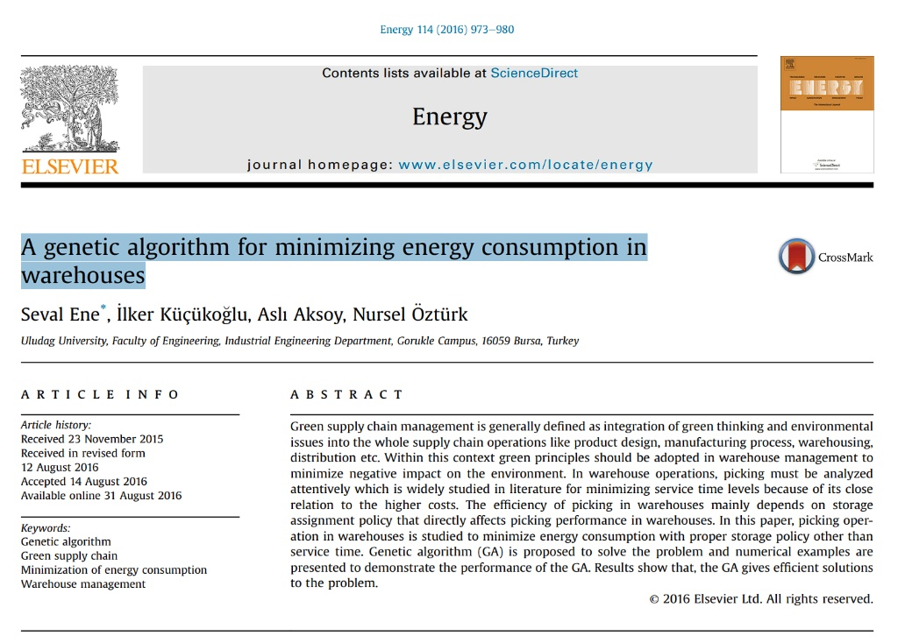

---
# try also 'default' to start simple
# theme: seriph
# random image from a curated Unsplash collection by Anthony
# like them? see https://unsplash.com/collections/94734566/slidev
# background: https://cover.sli.dev
# some information about your slides (markdown enabled)
title: Seminar
info: |
  Seminar
# apply UnoCSS classes to the current slide
class: text-center
# https://sli.dev/features/drawing
drawings:
  persist: false
# slide transition: https://sli.dev/guide/animations.html#slide-transitions
# transition: slide-left
# enable MDC Syntax: https://sli.dev/features/mdc
mdc: true
---

## A genetic algorithm for minimizing energy consumption in warehouses

  Zhao Zhiyu

<!--
Hello everyone. My name is Zhao Zhiyu.
My research is about helping robots find the best path in a busy warehouse.
-->

---
theme: seriph
layout: default
---

## Paper Reading Plan

 

### Last Week

* **Paper:** *Path planning techniques for mobile robots: Review and prospect*
* **Focus:** Understanding the core concepts of global vs. local planning (Chapter 2).

 

### This Week

* **Paper:** *A genetic algorithm for minimizing energy consumption in warehouses*
* **Focus:** Understanding the basic concepts, core types, and main algorithms of path planning.

 

### Next Week

* **Paper:** *A genetic algorithm for minimizing energy consumption in warehouses*
* **Focus:** Understanding Solution methodology and Numerical experiments.

---
# 这是一个注释：你可以使用 'layout: default' 或 'layout: bullets'
layout: default
---

---
# 这是一个注释：使用 'layout: default' 布局
layout: default
---

# Table of Contents

* <strong class="text-xl">1. Introduction</strong>
     Why we study this problem (the "green" goal).

* <strong class="text-xl">2. Literature review</strong>
     What old studies did vs. our new idea.

* <strong class="text-xl">3. Problem description</strong>
     The warehouse layout and forklift speeds.

* <strong class="text-xl">4. Solution methodology</strong>
     How our Genetic Algorithm (GA) works.

* <strong class="text-xl">5. Numerical experiments</strong>
     Testing the GA and showing the results.

* <strong class="text-xl">6. Conclusions</strong>
     What we learned and what to do next.

---
# 这是一个注释：你可以使用 'layout: default' 或 'layout: bullets'
layout: default
---

## Research Background and Motivation

 

<h3 class="flex items-center">
  1. Green Supply Chains Management
</h3>

*   **What is it?** GSCM means adding "green ideas" to the whole supply chain.
*   **Where?** This includes product design, making things, warehousing, and delivery.
*   **Why now?** Many companies and researchers now care about sustainability and our planet.

<h3 class="flex items-center">
  <i class="fa-solid fa-warehouse text-blue-600 mr-3"></i>
  2. Green Warehousing
</h3>

*   **A Must-Do:** Because GSCM is important, warehouses must also be "green."
*   **The Goal:** To reduce the bad effects on our environment.
*   **The Role:** Warehouses are a key part of any supply chain.

<h3 class="flex items-center">
  <i class="fa-solid fa-user-check text-orange-600 mr-3"></i>
  3. Customer Changes
</h3>

*   **New Needs:** Customers want things faster and more accurately. (e.g., from e-commerce)
*   **New Thinking:** At the same time, customers are thinking more about green problems and sustainability.

---
# 这是一个注释：使用 'layout: default' 布局
layout: default
---

# The Main Problem - Order Picking

  <h2 class="flex items-center">
    <!-- 图标：一个购物车 -->
    <i class="fa-solid fa-cart-shopping text-blue-600 mr-3"></i>
    1. Why Order Picking?
  </h2>

  * **What is it?** Getting items from shelves for customers.
  * **Key Points:**
      * In manual warehouses: It needs the most **workers**.
      * In auto warehouses: It costs the most **money**.
  * **The Big Problem:** It uses the most time and **the most energy**.

  <h2 class="flex items-center">
    <!-- 图标：一个放大镜，表示研究 -->
    <i class="fa-solid fa-magnifying-glass-chart text-orange-600 mr-3"></i>
    2. Old Studies
  </h2>

  * **Old Goal:** Most studies tried to make it faster (time) or cheaper (cost).
  * **What they missed:** They did not study **energy use**.

  <h2 class="flex items-center">
    <!-- 图S标：一个靶心，表示目标 -->
    <i class="fa-solid fa-bullseye text-green-600 mr-3"></i>
    3. Our Study
  </h2>

  * **New Idea:** We want to **use less energy** (not just less time).
  * **How?** We use a "Genetic Algorithm" (GA) to find the best way.
  * **How?:** How we store items on the shelves is also very important.

---
# 这是一个注释：使用 'layout: default' 布局
layout: default
---

# Literature review

  <h2 class="flex items-center">
    <!-- 图标：一个时钟 -->
    <i class="fa-solid fa-clock text-blue-600 mr-3"></i>
    Main Goal of Old Studies
  </h2>

  
Most studies tried to make warehouse operations <strong>faster (less time)</strong> or <strong>cheaper (less cost)</strong>.

  <ul class="list-disc pl-6 space-y-2">
    <li>
      <strong></strong> Made a system to save travel <strong>distance and cost</strong>.
    </li>
    <li>
      <strong></strong> Used GA to get the shortest <strong>travel distance</strong>.
    </li>
     <li>
      <strong></strong> Used math to lower <strong>travel cost</strong>.
    </li>
    <li>
      <strong></strong> Used simulation to study the <strong>picker's travel path</strong>.
    </li>
  </ul>

  
All these old papers only used <strong>time</strong>, <strong>distance</strong>, or <strong>cost</strong> to check if a solution was "good".

---
# 这是一个注释：使用 'layout: default' 布局
layout: default
---

# Our Contribution

  <h2 class="flex items-center">
    <!-- 图标：一片叶子 -->
    <i class="fa-solid fa-leaf text-green-600 mr-3"></i>
    1. Focus on "Green" Studies
  </h2>

  
Not many papers talk about "green" or "sustainable" warehouses.

  <ul class="list-disc pl-6 space-y-2">
    <li>
      <strong></strong> Talked about green order picking methods.
    </li>
    <li>
      <strong></strong> Studied energy use in <strong>automated</strong> (robot) warehouses.
    </li>
     <li>
      <strong></strong> Measured CO2 savings with a computer simulation.
    </li>
  </ul>

  <h2 class="flex items-center">
    <!-- 图标：一个灯泡，代表新想法 -->
    <i class="fa-solid fa-lightbulb text-yellow-500 mr-3"></i>
    2. New algorithm
  </h2>

  <ul class="list-disc pl-6 space-y-2">
    <li>
      <strong>It's Different:</strong> We study <strong>"picker-to-part"</strong> (manual) warehouses.
    </li>
    <li>
      <strong>Our Goal:</strong> We want to <strong>minimize energy use</strong>.
    </li>
    <li>
      <strong>Our Method:</strong> We use a Genetic Algorithm (GA) to solve two problems at once:
         
        - 1. Order <strong>Batching</strong> (grouping orders)
         
        - 2. <strong>Routing</strong> (finding the best path)
    </li>
  </ul>

---
# 这是一个注释：使用 'layout: default' 布局
layout: default
---

# The Problem (System & Layout)

  <h2 class="flex items-center">
    <!-- 图标：叉车 -->
    <i class="fa-solid fa-truck-forklift text-orange-600 mr-3"></i>
    1. System Setup
  </h2>

  <ul class="list-disc pl-6 space-y-2">
    <li v-clicks>
      <strong>System Type:</strong> Manual warehousing.
    </li>
    <li v-clicks>
      It's a <strong>"Picker-to-part"</strong>
    </li>
    <li v-clicks>
      <strong>How it works:</strong>
      <ul class="list-circle pl-6 mt-1">
        <li>Pickers follow an "order pick list".</li>
        <li>They drive a <strong>forklift</strong>.</li>
        <li>The trip starts at the "I/O point".</li>
      </ul>
    </li>
    <li v-clicks>
      <strong>Key Strategy:</strong> Order <strong>Batching</strong>.
      This means they group many orders into one trip.
    </li>
  </ul>

  <h2 class="flex items-center">
    <!-- 图标：网格布局 -->
    <i class="fa-solid fa-table-cells-large text-blue-600 mr-3"></i>
    2. Warehouse Layout
  </h2>

  <ul class="list-disc pl-6 space-y-2">
    <li v-clicks>
      <strong>Structure:</strong> 12 shelves, 13 picking aisles.
    </li>
    <li v-clicks>
      <strong>Details:</strong> 4 layers and 2 sides on each shelf.
    </li>
    <li v-clicks>
      <strong>Total:</strong> 2400 storage locations.
    </li>
    <li v-clicks>
      <strong>Key Sizes:</strong>
      <ul class="list-circle pl-6 mt-1">
        <li>Aisle Length: 62.5 m</li>
        <li>Aisle Width: 5 m</li>
        <li>Shelf Width: 2 m</li>
        <li>Space (horizontal): 2.5 m</li>
        <li>Space (vertical): 1.5 m</li>
      </ul>
    </li>
  </ul>

---
# 这是一个注释：使用 'layout: default' 布局
layout: default
---

# The Problem (Key Numbers)

  <h2 class="flex items-center">
    <!-- 图标：速度计 -->
    <i class="fa-solid fa-gauge-high text-blue-600 mr-3"></i>
    1. Forklift Speeds
  </h2>
  
We use these numbers to build our energy model.

  <ul class="list-disc pl-6 mt-4 space-y-2">
    <li>Horizontal Speed:   <strong class="text-2xl">10 km/h</strong></li>
    <li class="mt-4">Vertical Speed:   <strong class="text-2xl">0.53 km/h</strong></li>
  </ul>

  <h2 class="flex items-center">
    <!-- 图标：星星 -->
    <i class="fa-solid fa-star text-yellow-500 mr-3"></i>
    2. The Key Insight
  </h2>
  

    Driving side-to-side (10 km/h) is
  

  

    ~19x
  

  

    <strong>faster</strong> than lifting the fork up-and-down (0.53 km/h).
  

  <h2 class="flex items-center">
    <!-- 图标：路径 -->
    <i class="fa-solid fa-route text-green-600 mr-3"></i>
    3. What This Means
  </h2>
  <ul class="list-disc pl-6 mt-4 space-y-2">
    <li>
      <strong>The Real Problem:</strong> Moving <strong>up-and-down</strong> is the operation that uses the most time and energy.
    </li>
    <li class="mt-4">
      <strong>How to Save Energy:</strong> A good path (routing) must be smart. It must try to reduce the up-and-down travel.
    </li>
  </ul>

