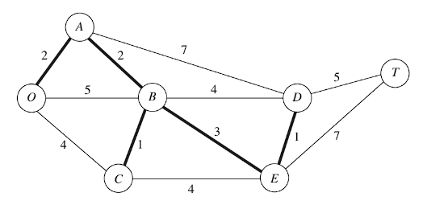
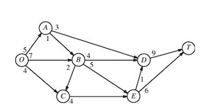
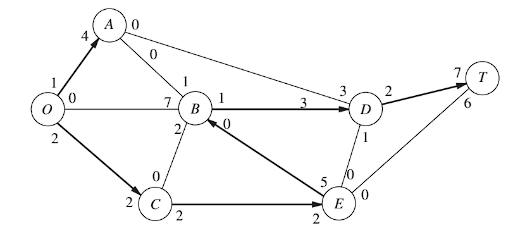
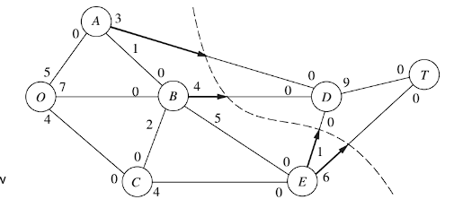

---
# try also 'default' to start simple
# theme: seriph
# random image from a curated Unsplash collection by Anthony
# like them? see https://unsplash.com/collections/94734566/slidev
# background: https://cover.sli.dev
# some information about your slides (markdown enabled)
title: Seminar
info: |
  Seminar
# apply UnoCSS classes to the current slide
class: text-center
# https://sli.dev/features/drawing
drawings:
  persist: false
# slide transition: https://sli.dev/guide/animations.html#slide-transitions
# transition: slide-left
# enable MDC Syntax: https://sli.dev/features/mdc
mdc: true
---

## The Maximum Flow Problem

  Zhao Zhiyu

---
layout: two-cols
---

# Problem Context & Goal

**The Scenario: Seervada Park**
* **Background:** Park management needs to route tram trips during the peak season.
* **The Goal:** Maximize the number of tram trips per day from the **Park Entrance (Station O)** to the **Scenic Wonder (Station T)**.
* **The Constraint:** To protect the local ecology and wildlife, there are strict upper limits (capacities) on the number of trips allowed on each specific road.

**Key Network Definitions:**
* **Source (Node O):** Where all flow originates (The Entrance).
* **Sink (Node T):** Where all flow terminates (The Scenic Wonder).
* **Capacity:** The number on each arrow indicating the max flow limit for that road.

::right::

  
  

---
layout: two-cols
---

# Solution Logic: Residual Network

**The Augmenting Path Algorithm**
* **Core Logic:** Repeatedly identify directed paths from source to sink with strictly positive residual capacity until no such path exists.

**Two Key Concepts:**
* **Residual Capacity:** How much more flow can fit? (Calculated as: Original Capacity - Used Flow).
* **Back-flow ("Regret Mechanism"):** The algorithm adds a "reverse" arc. If 5 units are assigned forward, the reverse capacity becomes 5.

**Why "Back-flow"?**
* **Function:** It permits the "cancellation" of previously assigned flows to reroute traffic, ensuring the global optimal solution is reached.

::right::

  
  

---
layout: two-cols
---

# Iteration Process: Finding Augmenting Paths

**Iteration 1:**
* **Path:** $O \rightarrow B \rightarrow E \rightarrow T$
* **Bottleneck:** $\min\{7, 5, 6\} = 5$
* **Action:** Send **5 units**; update residuals.

**Iteration 2:**
* **Path:** $O \rightarrow A \rightarrow D \rightarrow T$
* **Bottleneck:** $\min\{5, 3, 9\} = 3$
* **Action:** Send **3 units**.

**Subsequent Iterations:**
* **Logic:** Continue searching using **"reverse arcs"** (back-flow) until no path to Node T remains.

::right::

  
  

---
layout: two-cols
---

## Optimality Proof: Max-Flow Min-Cut Theorem

* Is our result (14 trips) truly the absolute maximum?

**Key Concepts:**
* **The Cut:** Imagine drawing a line through the network that completely separates the Source (O) from the Sink (T).
* **Cut Value:** The sum of the capacities of all the arcs cut by this line (in the forward direction).

**Max-Flow Min-Cut Theorem:**
* **Theorem:** Maximum Flow = Minimum Cut Value.
* **Meaning:** The network's "tightest bottleneck" determines the maximum possible flow.

**Verification:**
* In this case, we can find a specific cut (severing arcs like $A \rightarrow D$, $B \rightarrow D$, etc.) where the sum of capacities is exactly **14**.
* Since Flow (14) = Cut (14), the solution is optimal.

::right::

  
  

---
# Default single column layout
---

# Optimal Solution & Applications

**The Final Result (Optimal Solution):**
* **Total Max Flow:** **14 trips/day**.
* **Path Allocation:**
  * Arc $O \rightarrow B$: Full capacity (7).
  * Arc $O \rightarrow C$: Full capacity (4).

**Real-World Applications:**
* **Oil Pipelines:** Maximizing the flow of crude oil through a pipeline network.
* **Supply Chains:** Optimizing distribution from factories to customers.
* **Transportation:** Evaluating vehicle throughput capabilities in city grids.

By converting physical networks into mathematical models, we can identify **bottlenecks** (Min-Cut) and squeeze out **every bit of potential** (Max-Flow).

