---
# try also 'default' to start simple
# theme: seriph
# random image from a curated Unsplash collection by Anthony
# like them? see https://unsplash.com/collections/94734566/slidev
# background: https://cover.sli.dev
# some information about your slides (markdown enabled)
title: Seminar
info: |
  Seminar
# apply UnoCSS classes to the current slide
class: text-center
# https://sli.dev/features/drawing
drawings:
  persist: false
# slide transition: https://sli.dev/guide/animations.html#slide-transitions
# transition: slide-left
# enable MDC Syntax: https://sli.dev/features/mdc
mdc: true
---

## Research on Complex Logistics Environment Path Planning Based on Ant Colony Algorithm and Deep Reinforcement Learning

  Zhao Zhiyu

<!--
Hello everyone. My name is Zhao Zhiyu.
My research is about helping robots find the best path in a busy warehouse.
-->

---
layout: image-right
image: ./assets/robot.png
backgroundSize: 400px 80%
---

## Background

- 🤖 **Lots of Robots** - More and more robots are working in big buildings to move stuff for us.
- 🤔 **The Problem** - These places are very busy. The robots' old plans are too simple, so they get confused when things move.
- 🔋 **Wasted Power** - When they get confused, the robots take longer trips. This wastes a lot of electricity, which is not good for our Earth.

We need to give the robots a smarter brain. This will help them find the best path, save energy, and protect our world!

<!--
So, let's look at the background for my research.
First, there are lots of robots. Because we all shop online more, companies use more robots in their warehouses to move things quickly.
But there is a problem. These warehouses are very busy and always changing. The robots' plans are too simple, like a basic map. They get confused when something unexpected blocks their way.
This confusion causes them to take long, inefficient trips. This wastes a lot of battery power. With thousands of robots, it's a big waste of electricity and bad for the environment.
So, the goal of my research is to give these robots a smarter brain. A brain that can see the busy environment and make smart decisions. This will help them find the best path, save energy, and create a greener system.
-->

---
layout: image-right
image: ./assets/warehouse.png
backgroundSize: 400px 80%
---

## Objective

<!-- 
So, what is the objective of my research?
My goal is to create a system that combines two kinds of planning. You can think of it as a "big plan" and a "quick reaction" plan.
The "big plan" is Global Path Planning. It's like using a map to find the best main route for a long trip.
The "quick reaction" is Local Path Planning. This helps the robot see and avoid sudden obstacles, like another robot that is in the way.
When we combine these two plans, we get three good results:
The robot follows the best and most efficient main path.
It can quickly and safely avoid any surprises.
This makes the robot's final path both fast and flexible. This is the main goal.
-->

---
layout: image-right
image: ./assets/path planning.png
backgroundSize: 200px 80%
---

## Method

```mermaid
graph TD
    %% 1. 定义所有节点
    A[Start]
    B["Ant colony algorithm"]
    C["Dueling Double Deep Q-Network"]
    D["Reward"]
    E["Ensure local adjustments don't deviate from global path"]
    F[End]

    %% 2. 定义节点之间的连接关系
    A --> B
    A --> C
    B --> D
    C --> D
    D --> E
    E --> F
```

<!-- Now, I will explain my method. It uses two main parts that work together.

First, the Ant Colony Algorithm creates the "big plan." It finds the best and most efficient order to visit all the targets on the map.

Second, the Dueling Double Deep Q-Network is for the "quick reactions." It is the robot's smart brain that helps it make decisions in real-time to avoid any surprise obstacles.

The robot learns by getting rewards. It gets points for good actions, like following the big plan and avoiding walls.

A key rule is that the robot's quick, local moves should not go too far away from the efficient main path.

On the right, you can see an example. The top image shows the simple global path. The bottom image shows the robot's final path. It makes small changes to avoid things, but it still follows the main route. -->

---
layout: image-right
image: ./assets/ant.png
backgroundSize: 80%
---

## Global Path Planning

<b>Ant Colony Optimization</b>

* **Idea:** 
    * Ants leave a special scent on the ground.
    * Shorter paths get a stronger scent, which attracts more ants.

* **How Our Program Does It:**
    * "Virtual ants" in the computer explore many different routes.
    * Short routes get a strong "digital scent."

* **The Goal:**
    * To find the **best and shortest order** for the robot to visit all its targets.

<!-- First, let's look at Global Path Planning. I used the Ant Colony Optimization algorithm for this part.

The main idea comes from how real ants find food. When an ant finds a good, short path, it leaves a special scent. This scent gets stronger as more ants use the path, and it attracts even more ants.

My computer program does the same thing. I create "virtual ants" that explore many different routes to the robot's targets. When they find a short route, they leave a strong "digital scent."

The pictures on the right show this process. At first, the paths are random. But slowly, the shorter, better paths get a stronger scent, and the bad paths are forgotten.

So, the final goal of this method is to find the single best and shortest order for the robot to visit all of its targets. -->

---
layout: image-right
image: ./assets/D3QN.png
backgroundSize: 80%
---

## Local Path Planning

<b>Dueling Double Deep Q-Network</b>

* **Idea:** 
    * Inspired by how we train a pet with rewards.
    * The robot learns from trial and error, just like a pet learns tricks for a treat.

* **How Our Program Does It:**
    * The robot tries many different moves to explore the area.
    * It gets "points" (rewards) for good moves, like getting closer to the goal.
    * It loses points for bad moves, like hitting a wall.

* **The Goal:**
    * To teach the robot a smart strategy so it automatically knows the best and safest move to make in any situation.

<!-- Next is Local Path Planning. This is the "quick reaction" part of my method, and I used a technique called the Dueling Double Deep Q-Network.

The main idea is very similar to how we train a pet. The robot learns from trial and error. If it does something good, it gets a reward, and it learns to avoid bad actions.

In my program, the robot explores by trying many different moves. It gets points, or rewards, for good moves, like getting closer to its goal. And it loses points for bad moves, like hitting a wall.

The diagram on the right shows a small piece of the robot's "brain." This brain learns from all the rewards and punishments.

The final goal is to teach this brain a smart strategy. After a lot of training, the robot will automatically know the best and safest move to make in any situation. -->

---
# Frontmatter for configuration
title: 'Expected Results'
layout: center
---

## What We Hope to Achieve

  

    

      📈
    

    <h3 class="font-bold mt-2">More Efficient</h3>
    <ul class="text-left mt-2 text-sm">
      <li>Faster task completion</li>
      <li>Shorter travel distance</li>
      <li>Less waiting time</li>
    </ul>
  

  

    

      🛡️
    

    <h3 class="font-bold mt-2">Smarter & Safer</h3>
    <ul class="text-left mt-2 text-sm">
      <li>Higher success rate</li>
      <li>Better at avoiding surprises</li>
      <li>Fewer collisions</li>
    </ul>
  

  

    

      🌿
    

    <h3 class="font-bold mt-2">Greener</h3>
    <ul class="text-left mt-2 text-sm">
      <li>Less wasted energy</li>
      <li>Longer battery life</li>
      <li>Smaller carbon footprint</li>
    </ul>
  

  

    
  

<!-- So, what do we hope to achieve with this research? There are three main benefits.

First, the robots will be more efficient. This means they will finish their tasks faster, travel shorter distances, and spend less time waiting.

Second, they will be smarter and safer. They will be much better at avoiding surprise obstacles. This leads to a higher success rate and, most importantly, fewer collisions.

Finally, being more efficient also makes the robots greener. When they use less energy, their batteries last longer. This reduces electricity waste and helps lower the warehouse's carbon footprint, supporting sustainability. -->